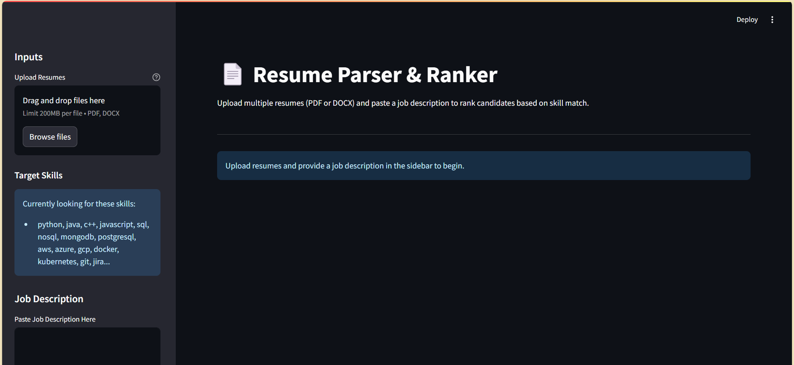
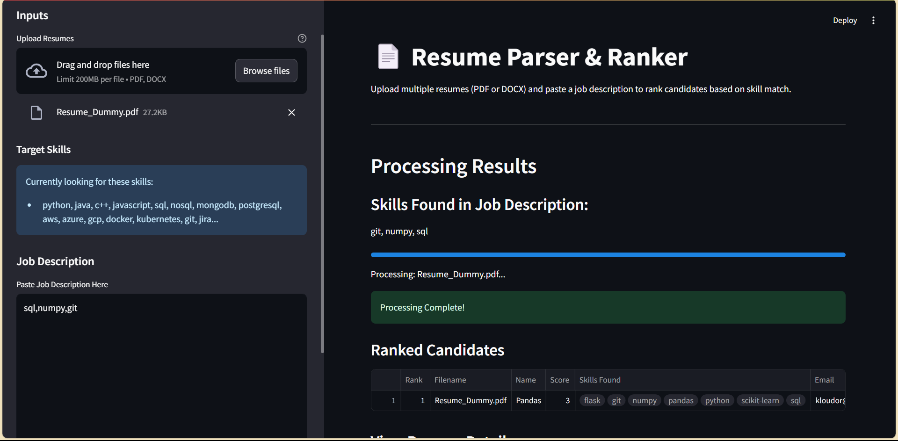
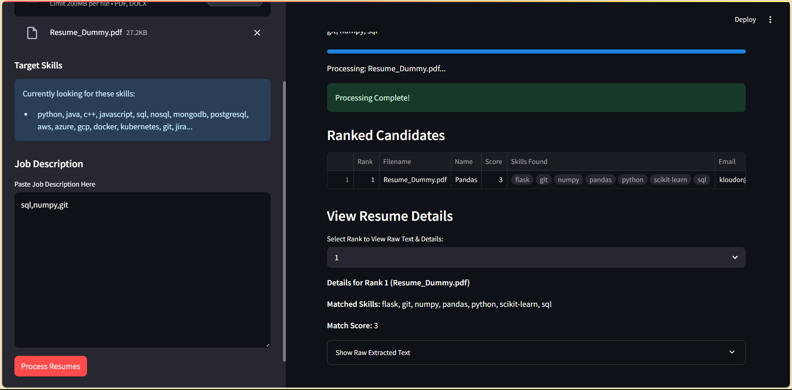

# Resume Parser & Ranker

> A powerful tool to parse, analyze, and rank resumes against job descriptions using NLP.

## 📋 Overview

Resume Parser & Ranker is a Streamlit-based web application that helps recruiters and hiring managers efficiently process multiple resumes. The application extracts key information from resumes, identifies skills, and ranks candidates based on their match to a specific job description.


## ✨ Features

- **Multi-format Support**: Process PDF and DOCX resume files
- **Batch Processing**: Upload and analyze multiple resumes simultaneously
- **Contact Information Extraction**: Automatically extract emails and phone numbers
- **Name Detection**: Uses NLP to identify candidate names
- **Skills Matching**: Identifies skills from a customizable target list
- **Job Description Analysis**: Extracts key skills from job descriptions
- **Candidate Ranking**: Ranks candidates based on skill match score
- **Interactive Results**: View detailed information for each candidate
- **Raw Text Review**: Access the extracted text for verification

## 🖼️ Screenshots

### Main Interface


### Results Dashboard


### Candidate Details


## 🚀 Installation

1. Clone the repository:
   ```bash
   git clone https://github.com/yourusername/resume-parser.git
   cd resume-parser
   ```

2. Create a virtual environment (recommended):
   ```bash
   python -m venv venv
   source venv/bin/activate  # On Windows: venv\Scripts\activate
   ```

3. Install the required dependencies:
   ```bash
   pip install -r requirements.txt
   ```

4. Download the spaCy language model:
   ```bash
   python -m spacy download en_core_web_sm
   ```

## 📝 Usage

1. Start the Streamlit application:
   ```bash
   streamlit run App.py
   ```

2. Open your web browser and navigate to the URL displayed in the terminal (typically http://localhost:8501)

3. Upload resumes using the file uploader in the sidebar

4. Paste the job description in the provided text area

5. Click "Process Resumes" to analyze and rank the candidates

6. Review the ranked results and explore candidate details

## ⚙️ Customization

### Target Skills

Modify the `TARGET_SKILLS` list in `App.py` to customize the skills the parser looks for:

```python
TARGET_SKILLS = [
    'python', 'java', 'c++', 'javascript', 'sql', 'nosql', 'mongodb',
    # Add or remove skills relevant to your needs
]
```

### Scoring Algorithm

The current scoring is based on a simple count of matching skills. You can enhance the algorithm in the `calculate_match_score` function for more sophisticated ranking.

## 🧩 How It Works

1. **Text Extraction**: Converts PDF/DOCX files to plain text
2. **Information Extraction**: Uses regex and NLP to extract contact details, names, and skills
3. **Job Description Analysis**: Identifies required skills from the job posting
4. **Matching Algorithm**: Compares resume skills against job requirements
5. **Ranking**: Orders candidates by match score
6. **Results Display**: Presents information in an interactive table

## 🛠️ Technologies Used

- **Streamlit**: Web application framework
- **spaCy**: Natural Language Processing
- **PyPDF2**: PDF text extraction
- **python-docx**: DOCX file processing
- **pandas**: Data handling and manipulation
- **Regular Expressions**: Pattern matching for contact information

## 📊 Future Enhancements

- [ ] Education and experience extraction
- [ ] More sophisticated scoring algorithm with skill weighting
- [ ] Support for more file formats
- [ ] Export results to CSV/Excel
- [ ] Improved name extraction accuracy
- [ ] Customizable scoring criteria
- [ ] Resume summarization

## 🤝 Contributing

Contributions are welcome! Please feel free to submit a Pull Request.

1. Fork the repository
2. Create your feature branch (`git checkout -b feature/amazing-feature`)
3. Commit your changes (`git commit -m 'Add some amazing feature'`)
4. Push to the branch (`git push origin feature/amazing-feature`)
5. Open a Pull Request

### **2. For your `Resume-Parser` repository:**

```markdown
---

### 🤖 AI-Assisted Development Process

This project was built using a "prompt-first" approach, where I leveraged an LLM as a coding co-pilot to translate a concept into a functional application.

*   **The Core Prompt:** I began by architecting the project with a high-level prompt, such as:
    > *"Create a Python application using Streamlit that allows a user to upload a resume file (like a PDF or DOCX). The application should then parse the text to extract key entities like name, contact information, skills, and work experience."*

*   **Iteration and Refinement:** The AI generated the core file upload and text extraction code. I then used follow-up prompts to add the intelligence layer:
    *   "Integrate the `spacy` library to perform Named Entity Recognition (NER) on the extracted text."
    *   "Write a function to specifically identify and list all extracted email addresses and phone numbers using regular expressions."
    *   "Display the parsed information neatly on the Streamlit page under clear headings like 'Personal Details' and 'Skills'."

*   **My Role as the Developer:** My primary role was not just to code, but to act as the architect. This involved designing the prompts, critically evaluating and debugging the AI-generated code, structuring the information extraction logic, and testing the final application to ensure it accurately parsed different resume formats.

## 📄 License

This project is licensed under the MIT License - see the [LICENSE](LICENSE) file for details.

## 📬 Author

Made With Vibes & ❤️ By Ankit Singh

Project Link: https://github.com/IBATMANSINGH/Resume-Parser

---

⭐️ If you found this project helpful, please give it a star on GitHub! ⭐️
